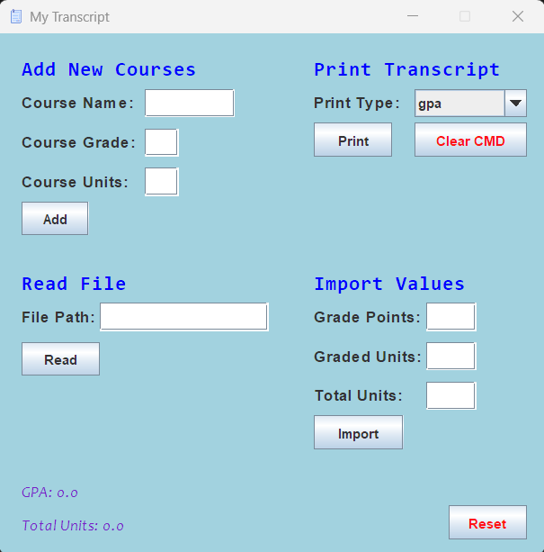

# Transcript Grader

The transcript grader is used to build an academic transcript.
The primary use of this tool is to calculate past/current/future GPAs.
The grader can also calculate class levels (freshman, sophomore, etc.).

The following is the default grade point scale:
- A+ : 4.0
- A  : 4.0
- A- : 3.7
- B+ : 3.3
- B  : 3.0
- B- : 2.7
- C+ : 2.3
- C  : 2.0
- C- : 1.7
- D  : 1.0
- F  : 0.0

Any grades not specified in the scale are considered P/NP or S/U classes.
Thus, they won't affect your GPA but are tracked in the transcript.

The following is the default thresholds for each class level:
- Freshman  : 0.0  - 44.0  (units)
- Sophomore : 45.0 - 89.0  (units)
- Junior    : 90.0 - 134.0 (units)
- Senior    : 135.0 >=     (units)

Both scales can be customized in `src/Transcript.java`.

## How to use the transcript grader

There are a total of five transcript modification operations: adding a new course, importing units, scanning a text file, printing information about the transcript, and resetting the transcript.
To begin, you can pick between using the command line or a JFrame to update the transcript.
To update the transcript through commands, run `make cmd` in the cmd.
The command line option supports `add`, `import`, `read`, `print`, `reset`, `cls`, `help`, `exit`.
To streamline repetitive commands, you can write commands on a text file.
Some examples are in `transcripts/`.
A quicker and easier method would be to use the built-in JFrame, which is created with `make frame` in the cmd.
Here is what the GUI of the JFrame looks like:



### Adding a course to the transcript
Command Syntax: `add <course name> <course grade> <course credits>`
To add a course using the JFrame, simply fill in the corresponding text fields and press add.
Here are some examples of the `add` command:

```
> make cmd
javac ./src/*.java
java ./src/Grader.java cmd

Awaiting user input:
> add MATH-20A A 4.0

Awaiting user input:
> add BILD-4 B 2.0

Awaiting user input:
> add "Discrete Mathematics" C- 4.0

Awaiting user input:
> add "Introduction to Structures and Design" P 4.0

Awaiting user input:
> print all

Your Course Transcript:
"Discrete Mathematics", Grade Received: C-, Units: 4.0
"Introduction to Structures and Design", Grade Received: P, Units: 4.0
BILD-4, Grade Received: B, Units: 2.0
MATH-20A, Grade Received: A, Units: 4.0

Grade Scale:
A+ : 4.0
A : 4.0
A- : 3.7
B+ : 3.3
B : 3.0
B- : 2.7
C+ : 2.3
C : 2.0
C- : 1.7
D : 1.0
F : 0.0

Your Grade Level: Freshman

Your GPA: 2.88
Total Units: 14.0

Awaiting user input:
> exit
```

### Importing grade points, graded units, and total units
Command Syntax: `import <grade points> <graded units> <total units>`
Grade points are the sum of grade value times units for each course.
Graded units are the units being used for GPA calculation.
Total units are all the units during import.
The main purpose of this function is to import P/NP, S/U, and transfer units.
The logic above is used for the JFrame for each respective field.
Here are some examples of the `import` command:

```
> make cmd
javac ./src/*.java
java ./src/Grader.java cmd

Awaiting user input:
> import 16.0 4.0 4.0

Awaiting user input:
> print gpa

Your GPA: 4.0
Total Units: 4.0

Awaiting user input:
> import 0.0 0.0 50.0 

Awaiting user input:
> print lvl

Your Grade Level: Sophomore

Your GPA: 4.0
Total Units: 54.0

Awaiting user input:
> exit
```

### Reading a file of commands
Command Syntax: `read <file path>`
Remember that file paths are read from the relative position of the repository.
For the JFrame, type the relative file path in the file path label and press read.
Here are some examples of the `read` command:

```
> make cmd
javac ./src/*.java
java ./src/Grader.java cmd

Awaiting user input:
> read ./transcripts/sample1.txt

Your GPA: 3.175
Total Units: 16.0

Awaiting user input:
> reset

Awaiting user input:
> read ./transcripts/sample2.txt

Your GPA: 3.5
Total Units: 16.0

Your GPA: 3.467
Total Units: 30.0

Your GPA: 3.642
Total Units: 48.0

Awaiting user input:
> exit
```

### Printing transcript information
Command Syntax: `print (gpa || lvl || scale || all)`
Unlike the other commands, print only accepts these arguments: `gpa`, `lvl`, `scale`, and `all`.
GPA prints the GPA and the number of units on the transcript.
Level prints GPA, units, and grade level.
Scale prints GPA, units, grade level, and the grade scale of the transcript.
All prints GPA, units, grade level, grade scale, and all the course on the transcript.
To select the print types on the JFrame, pick an option on the print drop-down menu and then press print.
Here are some examples of the `print` command:

```
> make cmd
javac ./src/*.java
java ./src/Grader.java cmd

Awaiting user input:
> add CSE-100 A 4.0

Awaiting user input:
> print gpa

Your GPA: 4.0
Total Units: 4.0

Awaiting user input:
> import 0 0 44

Awaiting user input:
> print lvl

Your Grade Level: Sophomore

Your GPA: 4.0
Total Units: 48.0

Awaiting user input:
> print scale

Grade Scale:
A+ : 4.0
A : 4.0
A- : 3.7
B+ : 3.3
B : 3.0
B- : 2.7
C+ : 2.3
C : 2.0
C- : 1.7
D : 1.0
F : 0.0

Your Grade Level: Sophomore

Your GPA: 4.0
Total Units: 48.0

Awaiting user input:
> add CSE-101 A 4.0

Awaiting user input:
> add CSE-120 A 4.0

Awaiting user input:
> print all

Your Course Transcript:
CSE-100, Grade Received: A, Units: 4.0
CSE-101, Grade Received: A, Units: 4.0
CSE-120, Grade Received: A, Units: 4.0

Grade Scale:
A+ : 4.0
A : 4.0
A- : 3.7
B+ : 3.3
B : 3.0
B- : 2.7
C+ : 2.3
C : 2.0
C- : 1.7
D : 1.0
F : 0.0

Your Grade Level: Sophomore

Your GPA: 4.0
Total Units: 56.0

Awaiting user input:
> exit
```

### Resetting the transcript
Command Syntax: `reset`
This command will delete all the courses in the transcript and zero all private variables.
Press the reset button on the JFrame to clear the transcript.
Here is an example of `reset` command:

```
> make cmd
javac ./src/*.java
java ./src/Grader.java cmd

Awaiting user input:
> add CSE-100 A 4.0

Awaiting user input:
> print all

Your Course Transcript:
CSE-100, Grade Received: A, Units: 4.0

Grade Scale:
A+ : 4.0
A : 4.0
A- : 3.7
B+ : 3.3
B : 3.0
B- : 2.7
C+ : 2.3
C : 2.0
C- : 1.7
D : 1.0
F : 0.0

Your Grade Level: Freshman

Your GPA: 4.0
Total Units: 4.0

Awaiting user input:
> reset

Awaiting user input:
> print all

Your Course Transcript:

Grade Scale:
A+ : 4.0
A : 4.0
A- : 3.7
B+ : 3.3
B : 3.0
B- : 2.7
C+ : 2.3
C : 2.0
C- : 1.7
D : 1.0
F : 0.0

Your Grade Level: Freshman

Your GPA: 0.0
Total Units: 0.0

Awaiting user input:
> exit
```

### Clearing the command line
Command Syntax: `cls`
When the command line gets too cluttered, use this command to clear the cmd.
Press the "Clear CMD" button on the JFrame to clear the cmd.

### Incase of forgotten syntax
Command Syntax: `help`
Enter the help command if you forget the syntax of any command.
This button isn't on the JFrame.
Example:
```
> make cmd
javac ./src/*.java
java ./src/Grader.java cmd

Awaiting user input:
> help

Command Syntax:
add <course name> <course grade> <course credits>
import <grade points> <graded units> <total units>
read <file path>
print (gpa || lvl || scale || all)
cls
exit
help

Awaiting user input:
> exit
```

### Exiting the program
Command Syntax: `exit`
To exit the program, enter the exit command on the command line.
Delete the JFrame to exit the program.